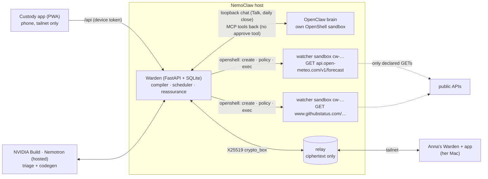

# Custody

**An AI that worries for you, and for the people you love, and speaks up only when someone actually needs you.**

Built for the NVIDIA Claw Agent Challenge (Berlin) on **NemoClaw** (OpenClaw + OpenShell) with **Nemotron**.

- **Hand over a worry.** Custody writes a small watcher program for it and locks it in its **own OpenShell sandbox**. The sandbox may only make the requests you approved on a permission card. Then Custody stays silent until you need to act.
- **Ask about someone you love.** "Is Anna OK?" Her Warden answers from her own device with one word from a fixed list, such as "Normal day". **No location, no data: one small encrypted answer**, and she sees every question.
- **Learn.** When a worry ends, Custody asks once whether it came true and counts *your* answers. For comparison only, research found that 91.4% of worries in a study of people with anxiety did not come true (LaFreniere & Newman, 2019). That figure is research, not your data, and the app labels it so.

Docs: [`docs/DESIGN.md`](docs/DESIGN.md) · [`docs/CONTRACTS.md`](docs/CONTRACTS.md) · [`docs/THREAT_MODEL.md`](docs/THREAT_MODEL.md) · [`docs/adr/`](docs/adr/) · [`docs/PLAN.md`](docs/PLAN.md) · second machine: [`docs/ANNA_SETUP.md`](docs/ANNA_SETUP.md)

## Architecture

How a worry is handled: **triage** (fast Nemotron) → **codegen** (Nemotron Super writes `run.py` against a fixed adapter library) → **AST gate** → **policy generated from the adapters' declared endpoints** (GET-only, no wildcards) → **dry run** in a throwaway sandbox → **your approval** in the app → the watcher runs in its own sandbox on a schedule. Output is parsed as JSON only: `ok` stays silent, and `act_now` produces one alert card with evidence.

## Quickstart (local, about 2 minutes)
You need [uv](https://docs.astral.sh/uv/), [pnpm](https://pnpm.io/) 9, and Node 22. uv fetches Python 3.12 itself.
```
git clone https://github.com/myronsydorov/nvidia-claw.git
cd nvidia-claw
make setup
make dev
```
Open http://127.0.0.1:5173. On first run, `make dev` creates `.env` and writes a random device token into it; paste the `WARDEN_DEVICE_TOKEN` value from `.env` into the app.

- **Without** `NVIDIA_API_KEY` in `.env`, the real compiler pipeline (gate, policy, dry run) runs on **recorded** model answers, and sandboxes are **mocks**. Try "Will my DHL parcel 00340434161094042557 arrive by Friday 16:00?".
- **With** a key from [build.nvidia.com](https://build.nvidia.com), every worry goes through live Nemotron.
- Ports: `make dev WARDEN_PORT=8001 APP_PORT=5174`.
- Second Warden and relay: `make relay`, then `RELAY_URL=http://127.0.0.1:8100` for each Warden.
- Checks: `make lint typecheck test` (Python 621 + app 93 tests), `make e2e`, `pnpm -C app e2e:mock`.

**Real sandboxes** need an OpenShell / NemoClaw Linux host:
- `make watcher-image`, then `make spike` (create → policy → exec → a denial in OpenShell's log → delete);
- `scripts/install-services.sh` (systemd user units, tailnet only via `tailscale serve`);
- `scripts/restart.sh` (healthy within 5 minutes);
- `scripts/demo-evidence.sh` (the live proof below).

## What is real, what is simulated, what is cut
| | State |
|---|---|
| **Real, deployed** | A NemoClaw host (DigitalOcean, Ubuntu 24.04) served to the owner's phone over Tailscale only. Live Nemotron triage and codegen through NVIDIA Build. **One OpenShell sandbox per running watcher**, created from the generated policy the person approved. The owner's real worries are being watched now (rain, GitHub status). A school-calendar watcher also runs, but it was a system test and is marked as one, so the ledger doesn't count it. |
| **Real, proven** | **A denied request in OpenShell's own audit log** (`scripts/demo-evidence.sh`). An `act_now` from a real sandbox reaching the app as one alert card, then "Did it happen?" (on a separate test Warden, removed afterwards). **"Is Anna OK?" end to end** between two Wardens on the host: pairing code, matching 8-digit fingerprints, sharing rules, answer in 0.9 s, privacy receipt, 10-minute cooldown, and the relay DB holding only ciphertext. The brain (OpenClaw in its own sandbox) handing a worry to the Warden over MCP. |
| **Simulated** | `make dev` uses mock sandboxes and, without a key, recorded model answers. The second person's Warden on a Mac runs **no sandbox**: it builds no watchers, it only answers ([`docs/ANNA_SETUP.md`](docs/ANNA_SETUP.md) states what proves privacy there and what doesn't). |
| **Not measured yet** | In the Ledger, *endpoints denied*, *median warning lead* and *came true by type* are shown as not counted, never as a fake zero. |
| **Cut this week** | Web push (alerts are in-app). Layer 3, shared watchers (vision only). The IMAP adapter (needs a non-GET ADR). Voice input. The DHL adapter needs `DHL_API_KEY` and wasn't exercised live. |

## Honest limits
- **Hosted inference (ADR-0003).** Worry text is sent to NVIDIA's hosted Nemotron endpoints for triage and code generation, so **L1 doesn't keep worry text on your device**. There is no local GPU; routing private worries to a local Nemotron Nano through NemoClaw is the roadmap. Reassurance answers (L2) are computed on the answering person's own device, and only the fixed-vocabulary answer leaves it, encrypted.
- **The relay sees metadata**: which key ids talk, when, and sizes. It never sees content. It has no mailbox auth, so it's published on the tailnet only (THREAT_MODEL A6).
- **The fingerprint check only helps if people compare it.** A relay that also knows the pairing code could try a man-in-the-middle within the 10-minute window (THREAT_MODEL A7).
- **DNS rebinding** of a worry-supplied host after approval is out of scope (THREAT_MODEL).
- **Public APIs are flaky.** BVG's community API was down on the morning of 2 Oct. The Warden retries, caches stops, and says plainly whose service failed. It never pretends.

## Security model, in one breath
Watched content is data, never instructions: it's parsed as JSON, and it passes the injection guard before any prompt that has tools. Every watcher gets its own sandbox, and its egress is generated from adapter declarations (GET-only, no wildcards, Landlock strict, approved by a human). The brain has **no** approval tool. The OpenClaw chat endpoint is loopback only. Reassurance uses a fixed vocabulary that is enforced before encryption. Secrets live outside git (0600 files) and out of logs (a test proves the NVIDIA key is never logged). Details: [`AGENTS.md`](AGENTS.md) (the 9 invariants), [`docs/THREAT_MODEL.md`](docs/THREAT_MODEL.md).

## For the judges
- **Deployed agent with real engineering.**
  - A live NemoClaw host with an OpenClaw brain in its sandbox, talking to the Warden over MCP. The Warden compiles each worry into code and turns it into OpenShell sandboxes and policies through one driver module (`warden/src/warden/sandbox/`).
  - `restart.sh` gets back to healthy in about 30–95 s, and a boot unit runs it.
  - Over 700 tests, CI, Playwright against a real Warden, and security reviews on every sandbox, relay and reassurance change.
- **Innovation.**
  - The agent *writes its own tools*, one per worry, and each is jailed by a policy derived from what it declared, not from what it asked for. The person approves exactly that card.
  - Between people, agents exchange **private reassurance** with a fixed vocabulary and end-to-end encryption, instead of sharing location.
- **Real-world value.**
  - It's built against anxious reassurance-seeking: silence by default, no "check again" loops, a 10-minute cooldown on asking, one question at the end ("did it happen?").
  - The ledger shows *your* rate of worries that came true. Its owner used it on real worries during the challenge week: rain during an outdoor shoot, GitHub on deadline night, and an S-Bahn commute.
