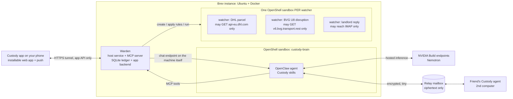

# Custody: design (v0.1)

> *An AI that worries for you, and for the people you love, and speaks up only when someone actually needs you.*

**Deadline:** Friday 2 Oct, late evening (Berlin). **Target submission:** Friday 20:00.
**Deliverable:** a short video (plus a public repo).
**Stack:** NemoClaw (OpenClaw + the OpenShell sandbox), Nemotron models via NVIDIA's hosted endpoints, and the **Custody app**, an installable phone web app (Telegram only as a developer fallback).

## 0. Where it runs

| Machine | Role | Why |
|---|---|---|
| **NVIDIA Brev cloud instance** (official NemoClaw one-click launchable) | **The always-on host**: brain, Warden, watcher sandboxes, app backend | Runs 24/7, NVIDIA-native (a good story for the judges), NemoClaw preconfigured. Fallback: any Ubuntu 24.04 cloud server (4 vCPU / 16 GB / 40 GB disk). |
| **MacBook Pro M3 Max** | Development, testing, recording the video | NemoClaw is "largely functional" on Apple Silicon with Docker Desktop. The known gaps are in routing to *local* models (which we don't use) and in installer robustness. Not the 24/7 host: a laptop sleeps. |
| **Intel MacBook with Ubuntu** | **"Anna's machine"**, the second agent for Layer 2 | Ubuntu is NemoClaw's main tested platform. Needs ≥ 8 GB RAM (plus 8 GB swap) and 20 GB free disk. |

Brev caveats: the OpenShell gateway listens only on the machine itself, and **nothing restarts automatically after a reboot**. We write a `restart.sh` and expose **only the Warden's app API** through an HTTPS tunnel, never the gateway.

---

## 1. Scope

| Layer | What | Status |
|---|---|---|
| **L1: Your worries** | Worry → its own watcher in its own sandbox → silence → alert only if you need to act → close → learn which worries come true | **Must** |
| **L2: The people you love** | Agent-to-agent *private reassurance*: "Is Anna OK?" → "Normal day." No location or raw data ever shared | **Must** |
| **L3: Shared watchers** | A watcher and its sandbox rules published together; another person's agent imports it safely | **Stretch** (only if L1 and L2 are done by Thursday night) |

**Non-goals this week:** smart-home devices, EU open banking, mobile app, a statistical anomaly model, anything that automates a platform against its terms.

---

## 2. Architecture



### Components

1. **Brain**: the OpenClaw agent inside the NemoClaw sandbox. Custody behaviour lives in `SKILL.md` skills plus standing orders ("never check again on demand", "never post as the user"). It uses the Warden through MCP tools. The **app never talks to it directly**. The Warden calls the gateway's OpenAI-compatible chat endpoint (`/v1/chat/completions`, enabled in the config) on the machine itself. OpenClaw's docs say that endpoint token equals full operator access, so it must never face the internet.
2. **Warden**: a host-side Python service (FastAPI plus an MCP server). It is the only component allowed to drive the `openshell` command line. It:
   - creates one sandbox per watcher: `openshell sandbox create … --label custody.watcher=<id>`;
   - applies that watcher's rules file: `openshell policy set <sbx> <yaml> --wait`;
   - runs watchers on a schedule: `openshell sandbox exec -n <sbx> -- python /w/run.py`, reading back a JSON result;
   - stores everything in SQLite (the worry ledger) and serves the **stats wall** web page.
3. **Watchers**: small Python programs *written by the agent* against a fixed adapter library (below), each with an **auto-generated, least-privilege** rules file. One sandbox each, so one watcher can never reach another watcher's endpoints or files.
4. **Relay** (L2): a dumb HTTPS mailbox that stores and forwards encrypted blobs. It never sees plain text. It's the only peer endpoint allowed in the rules.
5. **Friend's agent** (L2): the same install on a second computer, paired by a one-time code.

**Why a sandbox per watcher?** OpenShell matches permissions to the *executable's real path*, so two Python scripts that share an interpreter can't be told apart. One sandbox per watcher is the only real per-watcher least privilege, and it's the headline security story: **"every worry gets its own jail."**

---

## 3. Contracts

> **The canonical versions are in [`CONTRACTS.md`](CONTRACTS.md).** The examples below are illustrative only; if they differ, CONTRACTS.md wins.

### Worry
```json
{ "id": "w_0042", "text": "I'm worried my parcel won't arrive before Friday",
  "created_at": "...", "type": "checkable|deadline|person|social|uncontrollable",
  "fear": "parcel not delivered by 2026-10-02T18:00",
  "status": "triaging|awaiting_approval|watching|needs_you|resolved|parked",
  "watcher_id": "wt_0042", "resolution": null,
  "fear_came_true": null, "timeline": [] }
```

### Watcher result (stdout of `run.py`, the only thing a watcher can say)
```json
{ "status": "ok|act_now|resolved|error",
  "summary": "In transit, Leipzig hub, ETA Thu",
  "evidence": {"source": "DHL", "checked_at": "..."},
  "fear_came_true": null,
  "next_check_s": 3600 }
```

### Watcher rules (generated, shown to you for approval)
```yaml
network_policies:
  dhl_track:
    endpoints:
      - host: api-eu.dhl.com
        port: 443
        protocol: rest
        enforcement: enforce
        rules:
          - allow: { method: GET, path: "/track/shipments" }
    binaries:
      - path: /usr/bin/python3.12   # the real path, resolved at build time
```
Approval message in Telegram: *"Watcher 'DHL parcel' wants: GET api-eu.dhl.com/track/shipments. Nothing else. [Approve] [Deny]"*

### Reassurance protocol (L2)
- **Pairing:** exchange public keys via a one-time code (libsodium sealed boxes).
- **The watched person owns the rules:** who may ask, which question types ("ok?", "home yet?"), which answer levels.
- **Query:** `{from, about, q: "ok"|"home", nonce}`, encrypted to the peer's key.
- **Answer:** `{level: "normal"|"unusual"|"help"|"unknown", reason: "active_as_usual"|"quieter_than_usual"|"do_not_disturb"|..., ts}`. A **fixed set of values**; free text is never allowed.
- **"Normal day" signal (v1, honest and simple):** computer activity versus learned daily hours, calendar busy/free, the last check-in, and an explicit "I need help" message. Computed locally; only the answer level leaves the machine.
- **Proof for the video:** OpenShell's audit log on the friend's machine shows the *only* outbound traffic was one small encrypted POST to the relay.

---

## 4. The worry pipeline (L1)

1. **Intake:** a Telegram message ("I'm worried…").
2. **Triage** (Nemotron): classify the type; pull out *the exact fear*, a deadline, and which signal would settle it.
3. **Route:**
   - Checkable, or has a deadline → build a watcher.
   - About a person → the L2 protocol.
   - Social or uncontrollable → **park it** and schedule it for a weekly "worry time" review (a standard technique from cognitive behavioral therapy).
4. **Compile:** the LLM writes `run.py` against the adapter library, plus a rules file listing *only* the endpoints the adapters it uses declare.
5. **Dry run** in a fresh sandbox; if it fails, retry up to 2 times; if it still fails, park the worry and say so honestly.
6. **Approval:** the rules diff goes to Telegram with Approve/Deny buttons.
7. **Watch:** the Warden runs it on its schedule and stays **silent** while the status is `ok`.
8. **Act-now alert:** one message with the evidence and a suggested next step.
9. **Close:** on `resolved`, ask one question: "Did what you feared happen?" (yes/no). This feeds calibration.
10. **Learn:** per-category rate of worries that came true ("parcel worries: 1/9 came true").

**Adapter library (day 2):** `http_json` (generic GET), `rss`, `web_diff` (a page changed or contains X), `imap_search` (a reply arrived from someone), `ics_calendar`, `weather` (Open-Meteo), `transit` (BVG/DB via `v6.bvg.transport.rest`), `parcel` (DHL API), `flight` (a free flight-status API). Each adapter declares the endpoints it needs, and the rules are generated from those declarations.

**Guardrails (standing orders):** no on-demand "check again" loops (to avoid feeding clinical anxiety); silence is the default; it never acts externally beyond reading; it's peace of mind, not therapy.

---

## 5. The Custody app

**Format:** an **installable web app (PWA)**. You add it to your iPhone or Android home screen and it opens full-screen like a native app. Push notifications work on iPhone (iOS 16.4+) once it's added to the home screen. A native iOS app can't be built and approved in 3 days; a polished installable web app can.

**Stack:** React + Vite + Tailwind, served by the Warden. Live updates via server-sent events; alerts and approvals via web push. Sign-in: a pairing code, then a passkey or device token.

**Feel:** *calm*. Warm neutrals, one accent colour, generous space, a slow "breathing" pulse when all is quiet. It should look like a meditation app, not a monitoring dashboard. Dark mode.

**Screens:**
1. **Home: "All quiet."** Worries in custody, when each was last checked, and one input: *"What's on your mind?"* (text or voice).
2. **Hand-over.** An animated "taking custody" sequence: *understanding → writing a watcher → building its jail → asking your permission*. Then a **permission card** ("GET api-eu.dhl.com/track/shipments. Nothing else. [Allow] [Deny]") and finally **"I've got this."**
3. **Worry detail.** Timeline, what the watcher checks, its jail (the exact permissions), the last check, and a "Let it go" button.
4. **Act-now alert.** A push notification, then a card with the evidence and one suggested step.
5. **People.** Your paired loved ones and an **"Is Anna OK?"** button. The answer card reads "Normal day, 2 min ago", with a **privacy receipt**: "Shared: 1 answer, 212 bytes, encrypted. Location: never."
6. **What others can ask about me.** Rules per person, plus a log of every question anyone asked about you.
7. **Ledger.** The stats wall (section 6), also recorded for the video.
8. *(Stretch, L3)* **Borrow a watcher.** A shared watcher shown with its permission card.

**Voice (nice to have):** record → NVIDIA's Parakeet speech-to-text via the hosted endpoint → text. Another visible use of NVIDIA technology.

**Telegram:** kept only as a developer and debug channel. It isn't part of the product.

## 6. Stats wall (the Ledger screen)

- Worries handed over / still watched / **never needed you** / **needed you** (and how early it warned).
- **Came-true rate** by category, compared with the Penn State 91.4% finding.
- Watchers built / sandboxes live / rules approved / endpoints denied.
- L2: questions answered, **locations shared: 0**, bytes that left the friend's device.

---

## 7. Three-day build plan

Two parallel tracks: **you run the infrastructure and use it**; **Claude writes the code** (Warden, adapters, skills, app).

**Tue (now → night): foundation**
- [ ] *You:* Brev NemoClaw launchable up; NVIDIA key onboarded; chat endpoint enabled; Telegram as the debug channel.
- [ ] *Claude:* repo scaffold; Warden (FastAPI + SQLite + MCP); a hand-written watcher. **The spike:** create a sandbox / apply rules / run / delete it from the Warden, and measure how long that takes.
- [ ] *Claude:* the app shell running on fake data (Home, Hand-over, Worry detail), so the look is settled early.

**Wed: L1 end to end, in the app**
- [ ] Triage and routing; watcher compiler (code + rules) on the adapter library; dry run and retry.
- [ ] App wiring: hand over a worry, permission cards, live status; scheduler; act-now alerts; closing and "did it happen?".
- [ ] **By end of day:** 6 worry types work end to end from the phone. You start using it for real.

**Thu: L2, Ledger, push**
- [ ] Relay; pairing; encrypted query and answer; sharing rules; "normal day" signal; audit-log capture. Second install on the Intel MacBook (Ubuntu).
- [ ] People screen with the privacy receipt; "What others can ask about me" screen; Ledger; web push.
- [ ] *Stretch, Thursday night:* L3, publishing a watcher together with its rules, and "Borrow a watcher".

**Fri: polish and ship**
- [ ] Restart script, error states, empty states, README with the diagram.
- [ ] **Record the video on the phone and the M3 Max by 18:00. Submit by 20:00.**

**Cut lines, in this order:**
1. Voice → text only.
2. Web push → in-app alerts only.
3. 6 adapters → 4.
4. L2 on a second machine → two agents on one machine.
5. L3 stays a slide.

---

## 8. Video script (~2:30), filmed on a phone running the app

1. **Hook (0:00):** "91% of worries never come true. We carry them anyway."
2. **Parcel (0:15):** a worry → a watcher written live → the rules approval → silence.
3. **Unusual worry (0:45):** "Will the strike hit my U8 tomorrow?" → a transit watcher.
4. **"Is Anna OK?" (1:05):** → "Normal day." Then the audit log: one tiny encrypted message, zero locations.
5. **Stats wall (1:35):** real numbers from the week.
6. **Architecture (2:00):** NemoClaw, a sandbox per watcher, Nemotron.
7. **Vision (2:15):** L3, "every worry makes everyone's agent smarter." Close on the one-liner.

---

## 9. Risks and open questions

- **Scope creep from the app.** It's the most visible part and the easiest to polish forever. Screens 1–5 plus 7 are the must-haves; the rest are extras.
- **Brev reboots.** Nothing restarts automatically, so keep a tested `restart.sh`.

- **Speed of creating a sandbox per watcher.** Tested in Tuesday's spike. If it's too slow, fall back to a pool of pre-warmed sandboxes.
- **Nemotron's code-writing quality.** The fixed adapter library keeps the generated code small. If needed, send code-writing to a stronger hosted model through NemoClaw's routing.
- **Privacy wording.** With hosted inference, worry text goes to NVIDIA's endpoints. The video claims only what's true, or we add a local Nemotron Nano on a GPU VM to route private content locally.
- **Fairness in the video.** Label anything that isn't real usage.
